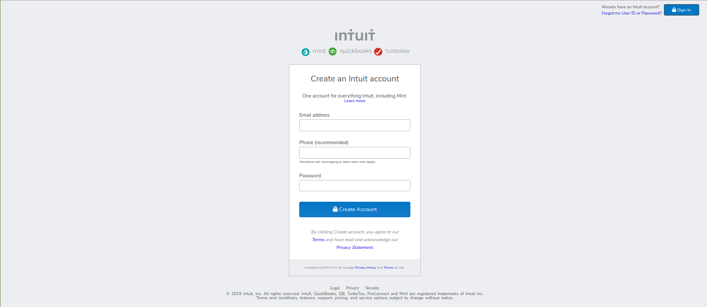

# Project: HTML_Form

This is the project of the Main HTML/CSS curriculum at [Microverse](https://www.microverse.org/)
The objective of the project is to develop an HTML form that matches the appearance of signup page of [mint.com](https://www.mint.com/).
Read more about the project detailed description from the [Odin website](https://www.theodinproject.com/courses/html5-and-css3/lessons/forms-for-collecting-data).

### [Assingment Link](https://www.theodinproject.com/courses/html5-and-css3/lessons/forms-for-collecting-data)
### [Live link](https://raw.githack.com/OlukaDenis/HTML_Form/master/index.html)

# Languages Used

- HTML
- CSS

# Contributing

If you are working on adding features, PRs, or bugfixes, this section should help get you going.

1. Fork it
2. Create your feature branch
   > `git checkout -b uour-feature-branch`
3. Commit your changes
   > `git commit -am 'Add some feature'`
4. Push to the branch
   > `git push origin my-new-feature`
5. Create new Pull Request

# Screenshot

# Authors

- [Denis Oluka](https://github.com/OlukaDenis)

- [Christian Salazar](https://github.com/Grifo89)
